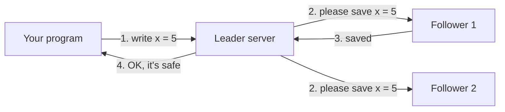

# raftkv

**A small database that keeps working when a computer crashes.**

raftkv stores data on three computers at once, so if one of them dies, nothing is lost and
the other two keep going. It is written in C++ and built on **Raft**, a well-known method for
getting several computers to agree. It is a learning project: it runs on one laptop
(pretending to be three computers), and it is not built to be fast.

## What it does, in one example

You can save a value and read it back, like a dictionary you talk to over the network:

```sh
raftkvctl put greeting hello            # save "hello" under the name "greeting"
raftkvctl append greeting ", world"     # add to the end of it
raftkvctl get greeting                  # prints: hello, world
```

Behind the scenes, that value is stored on three servers. You can crash any one of them
(even with `kill -9`, which gives it no chance to clean up) and the data is still there.

## Why this is hard

Keeping three copies in sync sounds easy: just send every change to all three. The trouble
starts when things go wrong:

- A server crashes halfway through saving a change. Did it save it or not?
- A message between servers gets lost, or arrives late, or arrives twice.
- The network splits, and two groups of servers each think they are in charge.

If the copies disagree, a user might write something, be told "saved!", and then never see it
again. Raft is a set of rules that makes that impossible.

## How Raft works, simply



1. **One server is the leader.** Every write goes to it.
2. **The leader writes the change into its log**, a numbered list of every change ever made,
   and sends it to the other servers (the followers).
3. **Once a majority has saved it to disk**, 2 out of 3, the change is **committed**: it can
   never be lost, even if a server crashes right after.
4. **Only then does the client hear "OK".**
5. **If the leader dies, the others hold an election** and pick a new leader. Raft's rules
   guarantee the new leader already has every committed change.

Why a majority? Any two majorities of three servers share at least one server, so a
committed change is always on at least one server in any group that can elect a leader.

## What happens when things break

| If this happens… | …raftkv does this |
|---|---|
| The leader crashes | The other two elect a new leader, and writes work again in about a third of a second. No confirmed write is lost. |
| One server is cut off from the others | The other two keep working. The cut-off one stops accepting writes, so it cannot hand out wrong answers. |
| All servers are cut off from each other | Everything pauses (no group has a majority). It refuses to answer rather than answer wrong, and carries on when the network heals. |
| A server crashes and restarts | It reads its saved data from disk and catches up on what it missed. |
| A server crashes in the middle of writing a file | It notices the half-written end of the file, throws it away, and catches up. |
| A server's file gets damaged (corrupted) | It refuses to start, instead of serving damaged data. |
| 20% of all network messages are lost | It keeps working, just slower, by sending requests again. |

## How we know it actually works

"It worked when I tried it" is not enough for this kind of system, because the bugs only show
up when the timing is unlucky. So raftkv is tested three ways:

1. **A simulator.** The whole cluster runs inside one program, with a fake network and a fake
   clock that the test controls. Tests crash servers, lose messages and split the network on
   purpose, thousands of times. Every run comes from a "seed" number, so any failure can be
   replayed exactly. After every single simulated event, the test checks Raft's safety rules,
   such as "never two leaders at once".
2. **A correctness checker** called [Porcupine](https://github.com/anishathalye/porcupine).
   It reads the full record of every request and every answer, and checks that there is one
   sensible order of events that explains all of them. If a confirmed write had vanished,
   there would be no such order, and the check fails. It has checked over 360,000 operations,
   including ones from real servers being crashed. All of them pass.
3. **Real crashes.** The real servers are started as separate programs, killed with
   `kill -9` mid-write, and restarted. This found a real crash bug that the simulator could
   not: [postmortem 002](docs/postmortems/002-pop-from-emptied-write-queue.md).

To check that the tests themselves are good, bugs were planted on purpose, and the tests
had to catch them. They did, and where one slipped through, a new test was added. Every test
also runs automatically on every change, on Linux, with two compilers and with tools that
detect memory and threading mistakes.

## Results

<!-- results:begin (generated by tools/results_table.py from docs/results.csv; do not edit) -->
Measured on one laptop (Apple M5), with three real server processes. Full tables, and how they were measured, are in [`docs/results.md`](docs/results.md).

| Question | Answer |
|---|---|
| How many writes per second can 3 servers handle? | about **888** (32 clients at once) |
| How long does one write take? | about **33 ms** (typical) |
| If the leader server crashes, how long until writes work again? | about **314 ms** |
| How much did writing to disk in batches help? | **4.7×** more writes per second |
| Did any test ever lose a write the store had confirmed? | **no** |
<!-- results:end -->

## Try it yourself

You need CMake, Ninja, a C++20 compiler and [vcpkg](https://github.com/microsoft/vcpkg)
(with the `VCPKG_ROOT` environment variable set). The first build downloads and builds the
libraries it uses, which takes a few minutes.

```sh
cmake --preset rel && cmake --build --preset rel     # build
ctest --preset rel                                   # run all the tests
```

Start three servers and use them:

```sh
cat > cluster.json <<'JSON'
{ "1": "127.0.0.1:7001", "2": "127.0.0.1:7002", "3": "127.0.0.1:7003" }
JSON
for i in 1 2 3; do ./build/rel/raftkvd --id $i --cluster cluster.json --data-dir data/$i & done

./build/rel/raftkvctl --cluster cluster.json put greeting hello
./build/rel/raftkvctl --cluster cluster.json get greeting          # hello
```

Or watch the whole story in one command. It starts three servers, has four clients write
continuously, crashes the leader, and then checks every answer for correctness:

```sh
tools/demo.sh
```

## What it does not do (yet)

- **It is not fast.** Every write waits for the disk to confirm it saved the data. That is what
  makes crashes safe, but disks are slow, so it handles hundreds of writes per second, not
  millions.
- **It runs on one computer.** The three "servers" are three programs on one laptop, talking
  over the network as if they were separate machines.
- **You cannot add or remove servers** while it is running, and there is only one group of
  three (no splitting data across many groups).
- **Power cuts are not tested.** Crashing a program is tested heavily, but cutting the power
  to the disk would need special tools.

## Words used above

| Word | Meaning |
|---|---|
| **Key-value store** | A database that works like a dictionary: you save a value under a name (the key) and look it up by that name. |
| **Replicated** | Stored as several copies, on different computers. |
| **Leader / follower** | The leader is the one server that accepts writes; the followers copy what it does. |
| **Log** | The numbered list of every change, in order. Every server keeps one. |
| **Commit** | A change is committed once a majority of servers have saved it. Then it can never be lost. |
| **Election** | How the servers choose a new leader when the old one stops responding. |
| **Majority** | More than half: 2 of 3, or 3 of 5. |
| **Snapshot** | A saved copy of all the data at one moment, so the log does not grow forever. |
| **`kill -9`** | A command that stops a program instantly, with no chance to save or clean up. Like pulling its plug. |
| **fsync** | Asking the operating system to really write data to the disk, instead of keeping it in memory for later. Slow, but needed to survive crashes. |
| **Linearizable** | The strongest everyday meaning of "correct": every operation seems to happen at one instant, in an order consistent with what every client saw. |

## Learn more

- [`docs/technical.md`](docs/technical.md): the full technical write-up: architecture, the
  fault matrix, what went wrong, and the limits in detail
- [`docs/results.md`](docs/results.md): every measurement, with before and after numbers
- [`docs/postmortems/`](docs/postmortems/): the real bugs found, and how
- [`raftkv.md`](raftkv.md): the project's goals and the predictions made before measuring
- [`raftkv-implementation.md`](raftkv-implementation.md): the step-by-step build plan, and what was actually built
- The original Raft paper: ["In Search of an Understandable Consensus Algorithm"](https://raft.github.io/raft.pdf) by Diego Ongaro and John Ousterhout
