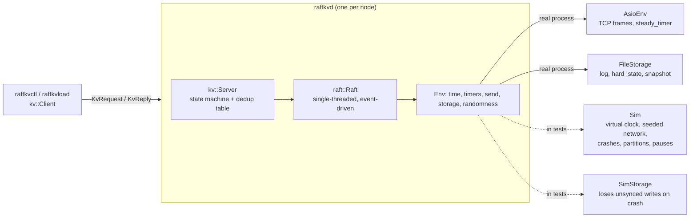

# raftkv

A replicated key–value store in C++20, built on the Raft consensus algorithm, written from
the paper. It runs as 3 or 5 processes on one machine over real TCP, survives the loss of a
minority of them without losing an acknowledged write, and **proves it**: a deterministic
simulator, a fault matrix, and a linearizability checker run over every history.
It is a learning project with stated limits: one Raft group, one machine, no transactions,
and durable writes are bound by fsync (about 250 writes/s per node on a laptop).

> **Status:** complete: built, tested, measured and written up.
> 132 tests run on every push: 129 unit and simulation tests, the real-process smoke test,
> the Porcupine check and the demo. They run under ASan/UBSan, TSan and Release, with gcc-13
> and clang-17.

## What it does

- **Replicates:** every node applies the same writes in the same order (leader election,
  log replication and the §5.4.2 commit rule, from Figure 2 of the paper).
- **Survives failures:** `kill -9` the leader and writes resume in about half a second
  (495 ms median, measured), with nothing acknowledged lost.
- **Fails safely:** a node cut off from the majority commits nothing. With no majority
  anywhere, the cluster stops answering rather than answer wrongly.
- **Recovers from crashes:** a checksummed, fsynced log and an atomically replaced hard
  state and snapshot. A torn write is cut off; any other damage makes the node refuse to start.
- **Serves a KV API:** `Get`, `Put`, `Append`. Reads go through the log, and duplicate
  detection applies a retried request once, across failovers and snapshots.
- **Compacts its log:** over 100,000 operations the log never held more than 204 entries
  (11 KB), and a node that was down from the start catches up from a snapshot in under 60 ms.

## Architecture



The Raft core never blocks, never takes a lock and never asks the OS for anything. It is
driven one event at a time, and everything nondeterministic comes through one `Env`
interface. Tests give it the simulator, so a whole cluster runs in one process on a virtual
clock and any failure replays from `RAFTKV_SEED=N`. `raftkvd` gives it Asio and real files.
The same `Raft` and `kv::Server` code runs in both.

## How it is tested

- **Deterministic simulator:** seeded network, crashes, partitions, pauses and message
  loss. Raft's safety properties are checked after **every** simulated event: one leader per
  term, Leader Completeness, committed entries never change, and State Machine Safety. A
  golden test checks that a seed replays byte-identically on macOS and Linux.
- **Fault matrix:** every row below is an automated test.
- **Linearizability:** client histories are checked with
  [Porcupine](https://github.com/anishathalye/porcupine) (via `tools/lincheck`, a small Go
  dev tool): 540 simulator histories (about 297k operations) and a real-process history
  that spans a `kill -9` of the leader. All linearizable. Planted bugs (stale local reads,
  no dedup, replying before commit, dedup missing from snapshots) are all caught; see
  [`docs/lincheck/`](docs/lincheck/).
- **Real processes:** `tests/cluster/smoke.sh` and `tools/demo.sh --check` run `raftkvd`
  for real and `kill -9` it. CI repeats the smoke test 10× per job.
- **Memory and thread safety:** ASan/UBSan and TSan in CI, with a hardened standard
  library. The on-disk log decoder is fuzzed with libFuzzer (over a million inputs a
  minute, and CI fuzzes every push).
- **Mutation checks:** each phase planted the bugs its tests exist for and confirmed they
  fail. Where one went undetected, a test was added.

## Fault matrix

Every row is an automated test. In the simulator, each row runs under 20 seeds (any one
replays with `RAFTKV_SEED=N`), with 3 servers and 3 clients doing get/put/append. The Raft
invariants are checked after every event, and every run's history goes through the
linearizability checker, which is what "no acknowledged write lost" means here. Rows marked
in the last column also run against real `raftkvd` processes (`tests/cluster/smoke.sh`).

| Scenario | Injection | Expected | Measured | Simulator test | Real processes |
|---|---|---|---|---|---|
| Leader crash mid-write | kill the leader after it sent `AppendEntries`, before commit | new leader ≈1 s; no acknowledged write lost | new leader in 241 ms median, 496 ms max | `LeaderCrashMidWrite` | ✓ every node `kill -9`'d mid-write |
| Minority partition | cut 1 of 3 off (leader or follower) | majority serves; minority refuses writes | the cut-off node commits nothing | `MinorityPartition` | |
| Majority partition | cut every server off from every other | **unavailable, not inconsistent** | nothing commits, no op completes; consistent after healing | `MajorityPartition` | |
| Follower crash + restart | `kill -9` a follower, restart 1 s later | catches up | recovers from its own log, then catches up | `FollowerCrashAndRestart` | ✓ all nodes `kill -9` |
| Slow follower: slow replies | +500 ms on its replies to the leader | available; p50 unchanged | available; p50 **+12%**, throughput −10% (median of 20 seeds); no extra elections. Commits wait for the one fast follower instead of the faster of two | `SlowFollowerReplies` | |
| Slow follower: slow link both ways | +500 ms each way | available; p50 unchanged | available; p50 +2%, throughput −7% median, **−22% worst**. The slow follower keeps timing out and calling elections (98 over 20 seeds): no PreVote | `SlowFollowerLinkBothWays` | |
| Message drops | 20% of all messages, 5 s | progress continues via retries | every client progresses, at **5.2%** of normal throughput: each loss costs the client a 500 ms timeout | `TwentyPercentMessageDrops` | |
| Paused leader | `SIGSTOP` the leader for 1 s | followers elect; old leader steps down on resume | as expected | `PausedLeader` | |
| Torn log tail | half a record at the end of a follower's log | cuts it off, rejoins, catches up | as expected | `TornLogTail` | |
| Corrupt log tail | flip a byte in a complete, synced record | refuses to start; no stale reads | refuses to start; the other two keep serving | `CorruptLogTail` | ✓ |

Three rows did not match the plan's expectation, and the table says so rather than tuning
the tests until they did. The slow-replies latency cost is inherent to a 3-node cluster
with one slow member. The slow-link elections come from having no PreVote. The 20%-drop
slowdown comes from the client, which waits a full 500 ms and then moves to another server
after any loss; Phase 9 measures that before anything is changed.

## Results

<!-- results:begin (generated by tools/results_table.py from docs/results.csv; do not edit) -->
Measured on Apple M5, 10 cores, 16 GiB, macOS 26.6.2, on 2026-10-03. Real `raftkvd` processes on one machine, driven by `raftkvload` (closed-loop clients, 16-byte values), durable fsync unless stated. Throughput figures are the median of three 10 s runs (the build-type rows are single runs). They compare configurations on this laptop; they are not a claim about production hardware.

| Cluster size (writes, 32 clients) | Throughput | Write p50 | Write p99 |
|---|---|---|---|
| 1 node | 250 ops/s | 128.10 ms | 147.90 ms |
| 3 nodes | 210 ops/s | 154.60 ms | 200.50 ms |
| 5 nodes | 194 ops/s | 161.20 ms | 239.80 ms |

| Reads vs writes (3 nodes, 8 clients, 50% writes) | p50 | p99 |
|---|---|---|
| Get (through the log) | 54.66 ms | 76.54 ms |
| Put | 54.68 ms | 82.61 ms |

| Measurement | Result |
|---|---|
| Recovery after `kill -9` of the leader (3 nodes, 5 kills) | median 495 ms, max 503 ms |
| Throughput with one follower stopped (`SIGSTOP`; stands in for a minority partition) | 214 ops/s, vs 210 with all three |
| Batching: up to 64 entries per `AppendEntries` vs 1 | 214 vs 63 ops/s (**3.39×**) |
| Cost of durable fsync | 216 ops/s durable vs 119,900 without fsync (**554.3×**) |
| Servers built release | 213 ops/s |
| Servers built asan+ubsan | 197 ops/s |
| Servers built tsan | 185 ops/s |
| 20% message drops (simulator, virtual time) | 5.2% of normal throughput |

| Snapshot cost (state size) | Take (serialize) | Restore | Save durably + compact |
|---|---|---|---|
| 1,000 keys | 0.06 ms | 0.13 ms | 16.38 ms |
| 10,000 keys | 0.66 ms | 1.50 ms | 17.75 ms |
| 100,000 keys | 6.49 ms | 14.40 ms | 24.05 ms |

One log append plus sync takes 4,056 µs with fsync and 6.5 µs without, which is the floor on every committed write's latency.

**Predictions**, committed before measuring ([`raftkv.md`](raftkv.md) §7):

| Prediction | Measured | Verdict |
|---|---|---|
| 3 → 5 nodes costs about 25% of write throughput | 7.3% | ✗ wrong: much smaller |
| Writes resume within 1000 ms of `kill -9` of the leader | median 495 ms, max 503 ms | ✓ held |
| Batching gives about 2× | 3.4× | ✗ wrong: underestimated |

**What the numbers say.** Every write is bound by fsync. One append plus `F_FULLFSYNC` takes 4.06 ms, a ceiling of about 247 syncs per second, and a single node reaches 250 ops/s: the leader syncs once per proposal, with no group commit across concurrent requests. Without fsync the same cluster does 119,900 ops/s. That is why extra followers cost so little (followers sync in parallel with each other), why sanitizer builds are barely slower, and why batching matters more than predicted: with one entry per RPC, followers sync once per entry too. Leader recovery is set by the client's 500 ms request timeout, not by the election (150–300 ms): the request in flight to the dead leader has to time out first. Group commit and a shorter, adaptive client timeout are the two obvious next steps.
<!-- results:end -->

## What went wrong

Everything here was found by the tests above, and each is written up.

- **A server could crash when a peer died mid-write**
  ([postmortem 002](docs/postmortems/002-pop-from-emptied-write-queue.md)). It only shows up
  with real sockets, which the simulator never uses. The repeated real-process test caught
  it (5 of 20 Release runs crashed). A hardened standard library now traps it at the exact line.
- **The invariant checker was stricter than the paper**
  ([postmortem 001](docs/postmortems/001-leader-completeness-check-too-strict.md)). A node
  paused mid-election legitimately led an old term. The fix was to state Leader
  Completeness exactly as Figure 3 does.
- **The first on-disk record format** (`[len][crc][payload]`) could not tell a damaged
  length from a torn write, so recovery could silently drop synced records. Caught in design
  review, before any data was written; records now carry a header checksum.
- **Two of three benchmark predictions were wrong**, recorded before measuring (see
  Results): five nodes cost 7.3% rather than 25%, and batching gave 3.4× rather than 2×.
  Both come from not yet appreciating how completely fsync dominates.
- **Three fault-matrix rows did not meet the plan's expectation**, and the table reports
  them as measured rather than with the thresholds adjusted until they passed.
- **Test bugs:** a deadline-less test that could hang, a smoke test that "corrupted" an empty
  file, and guessed thresholds that the data contradicted. Each was found and fixed, with
  the reason in the commit history.
- **The checker has not found a real bug** that the other tests missed. That was prediction 5;
  so far it is wrong. It has caught every planted one.

## Limits and next steps

- **fsync-bound writes:** each request pays its own 4 ms `F_FULLFSYNC`. **Group commit**
  (one sync for many requests) is the biggest available win: without fsync the same
  cluster does about 120,000 ops/s.
- **Failover is set by the client:** a 500 ms request timeout dominates the ~500 ms pause,
  and the client then retries a different server. A shorter, adaptive timeout and retrying
  the same server once would cut it. The same design costs 95% of throughput at 20% loss.
- **No PreVote or CheckQuorum:** a node that comes back from a partition forces an
  election, and a slow follower keeps doing so (measured: up to 22% throughput).
- **Snapshots travel in one message**, so the state must fit a 16 MiB frame.
- **Not tested: power loss.** `kill -9` cannot show that fsync is durable. `SimStorage`
  models lost unsynced writes; the disk itself would need LazyFS or `dm-log-writes`.
- **Out of scope for v1:** membership changes, `ReadIndex`/lease reads, a gRPC front end,
  multi-Raft sharding, client-session eviction.
- **Open question:** once, before snapshots existed, the smoke test's corruption step found
  its byte missing from the file afterwards. It has not recurred in the 300-odd runs since; the
  test now verifies the corruption and fails fast with logs if it happens again.

## Building

Needs CMake ≥ 3.25, Ninja, a C++20 compiler and [vcpkg](https://github.com/microsoft/vcpkg) with `VCPKG_ROOT` set.

```sh
cmake --preset dev          # Debug + ASan/UBSan; also: tsan, rel
cmake --build --preset dev
ctest --preset dev
```

The first configure builds all dependencies through vcpkg, which takes a few minutes.

## Running a cluster

```sh
cat > cluster.json <<'JSON'
{ "1": "127.0.0.1:7001", "2": "127.0.0.1:7002", "3": "127.0.0.1:7003" }
JSON
for i in 1 2 3; do ./build/rel/raftkvd --id $i --cluster cluster.json --data-dir data/$i & done

./build/rel/raftkvctl --cluster cluster.json put greeting hello
./build/rel/raftkvctl --cluster cluster.json append greeting ", world"
./build/rel/raftkvctl --cluster cluster.json get greeting     # hello, world
```

Kill any one server with `kill -9` and the other two keep serving; restart it and it
catches up from its data directory.

## Demo

`tools/demo.sh` runs the whole story in one command: start a 3-node cluster, run four
clients reading and writing, `kill -9` the leader mid-stream, then check every operation the
clients saw with Porcupine. CI runs it on every push (`tools/demo.sh --check`).

| One run (Apple M5 laptop, 2026-10-03) | Result |
|---|---|
| Cluster | 3 real `raftkvd` processes, durable fsync |
| Load | 4 clients, 12 s, get/put/append on 3 keys |
| Fault | `kill -9` of the leader (node 2) at 5 s |
| New leader | node 1 |
| Longest pause in completed operations | 493 ms |
| Operations | 1,596, every one checked |
| Linearizable (Porcupine) | **yes**: 0 illegal |

The full output of that run:

```text

▶ Starting a 3-node raftkv cluster (real processes, durable fsync)
  nodes 1, 2, 3 up; node 2 is the leader

▶ Four clients writing and reading continuously, for 12s
  t= 1s     125 ops/s
  t= 2s     120 ops/s
  t= 3s     128 ops/s
  t= 4s     116 ops/s

▶ kill -9 the leader (node 2)
  t= 5s     120 ops/s
  t= 6s      89 ops/s
  t= 7s     160 ops/s
  t= 8s     144 ops/s
  t= 9s     150 ops/s
  t=10s     146 ops/s
  t=11s     150 ops/s
  node 1 took over; the longest pause in completed operations was 493.0 ms; 1592 operations in all

▶ Checking every operation for linearizability (Porcupine)
lincheck: 1 histories, 1596 ops (0 never returned): 0 illegal, 0 timed out

▶ One limit, stated plainly: every write waits for a 4 ms F_FULLFSYNC, once per request
  (no group commit yet), so a node tops out near 250 writes/s; and the pause above is
  mostly the client's 500 ms request timeout, not the election.

demo: PASS
```

## Stack

C++20 · CMake + Ninja · vcpkg · standalone Asio · Protocol Buffers · GoogleTest · Google Benchmark · libFuzzer · Porcupine (Go) · GitHub Actions

## More detail

- [`raftkv.md`](raftkv.md): goals, scope, and the predictions with their outcomes
- [`raftkv-implementation.md`](raftkv-implementation.md): the phase-by-phase plan, with what was actually built
- [`docs/postmortems/`](docs/postmortems/): the real bugs found
- [`docs/lincheck/`](docs/lincheck/): what a linearizability failure looks like
- [`docs/results.csv`](docs/results.csv): the raw measurements
