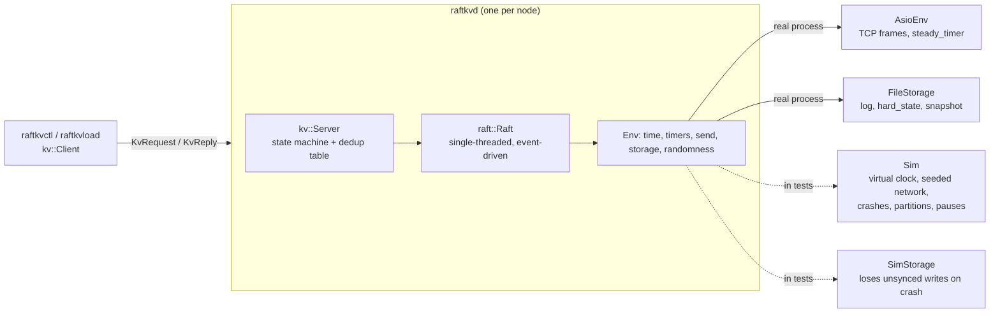

# raftkv: the technical details

The [README](../README.md) explains raftkv in plain language. This page is the detail behind
it: the architecture, how it is tested, the fault matrix, what went wrong, and the limits.
The measurements are in [`results.md`](results.md), generated from the CSV files.

## Architecture

- **The Raft core** (`src/raft/raft.cpp`) never blocks, never takes a lock and never asks
  the OS for anything. It is driven one event at a time, and everything nondeterministic
  comes through one `Env` interface. Tests give it the simulator, so a whole cluster runs in
  one process on a virtual clock and any failure replays from `RAFTKV_SEED=N`. `raftkvd`
  gives it Asio and real files. The same `Raft` and `kv::Server` code runs in both.
- **What Raft does here:** leader election with **PreVote** and **CheckQuorum**; log
  replication with the §5.4.2 commit rule and conflict hints; **group commit** (one fsync
  for every proposal that arrived since the last); snapshots and `InstallSnapshot`.
- **Storage** (`src/store/`): an append-only log of records with their own header checksum,
  plus `hard_state` and `snapshot` files replaced atomically (temp file, fsync, rename,
  fsync the directory). A torn last record is cut off; any other damage makes the node
  refuse to start.
- **The KV layer** (`src/kv/`): `Get`/`Put`/`Append`, all through the log. A per-client
  `(client_id, seq)` dedup table, also kept in snapshots, applies each request once. The
  client follows leader hints and adapts its timeout to measured round trips (RFC 6298),
  resending once to the same server before moving on.
- **The real server** (`src/net/`, `apps/`): one thread per process running an Asio
  `io_context`, with length-prefixed protobuf frames over TCP.

## How it is tested

- **Deterministic simulator.** It covers a seeded network, crashes, partitions, pauses,
  message loss and slow links. Raft's safety properties are checked after **every**
  simulated event:
  - one leader per term;
  - Leader Completeness;
  - committed entries never change;
  - State Machine Safety.

  Golden tests check that a seed replays byte-identically on macOS and Linux.
- **Fault matrix.** Every row below is an automated test.
- **Linearizability.** Client histories are checked with
  [Porcupine](https://github.com/anishathalye/porcupine), via `tools/lincheck`, a small Go
  dev tool:
  - 540 simulator histories, about 361k operations;
  - a real-process history that spans a `kill -9` of the leader.

  All are linearizable. Planted bugs (stale local reads, no dedup, replying before commit,
  dedup missing from snapshots) are all caught; see [`lincheck/`](lincheck/).
- **Real processes.** `tests/cluster/smoke.sh` and `tools/demo.sh --check` run `raftkvd`
  for real and `kill -9` it. CI repeats the smoke test 10× per job.
- **Power loss.** `tests/power_loss_test.cpp` runs `FileStorage` on a model disk
  (`tests/power_loss_io.hpp`) that loses power at a random file operation, including
  mid-snapshot and mid-recovery. Unsynced appends keep any prefix of their bytes; a new or
  renamed name survives only after the directory is synced. Recovery must keep everything
  the `Storage` contract made durable and invent nothing: 400 seeds × 12 power cuts.
  Planted bugs (no directory fsync, renaming an unsynced file, no log fsync) are each caught.
  This tests the *order* of writes and fsyncs, not whether a real drive honors a flush.
- **Memory and thread safety.** ASan/UBSan and TSan run in CI, with a hardened standard
  library. The on-disk log decoder is fuzzed with libFuzzer: over a million inputs a minute,
  and CI fuzzes every push.
- **Mutation checks.** Each phase planted the bugs its tests exist for, and confirmed the
  tests fail. Where a planted bug went undetected, a test was added for it.

## Fault matrix

Every row is an automated test (`tests/fault_matrix_test.cpp`). It runs under 20 seeds
(any one replays with `RAFTKV_SEED=N`), with 3 servers and 3 clients doing get/put/append.
The Raft invariants are checked after every event, and every run's history goes through
the linearizability checker, which is what "no acknowledged write lost" means here. Rows
marked in the last column also run against real `raftkvd` processes.

| Scenario | Injection | Expected | Measured | Simulator test | Real processes |
|---|---|---|---|---|---|
| Leader crash mid-write | kill the leader after it sent `AppendEntries`, before commit | new leader ≈1 s; no acknowledged write lost | new leader in 224 ms median, 499 ms worst | `LeaderCrashMidWrite` | ✓ every node `kill -9`'d mid-write |
| Minority partition | cut 1 of 3 off (leader or follower) | majority serves; minority refuses writes | the cut-off node commits nothing; a cut-off leader steps down (CheckQuorum) | `MinorityPartition` | |
| Majority partition | cut every server off from every other | **unavailable, not inconsistent** | nothing commits, no op completes; consistent after healing | `MajorityPartition` | |
| Follower crash + restart | `kill -9` a follower, restart 1 s later | catches up | recovers from its own log, then catches up | `FollowerCrashAndRestart` | ✓ all nodes `kill -9` |
| Slow follower: slow replies | +500 ms on its replies to the leader | available; p50 unchanged | available; p50 **+11%**, throughput −10% (median of 20 seeds). Commits wait for the one fast follower instead of the faster of two | `SlowFollowerReplies` | |
| Slow follower: slow link both ways | +500 ms each way | available; p50 unchanged | available; p50 +10%, throughput −10%; **no extra elections** (PreVote). Before PreVote: 98 forced elections and up to −22% | `SlowFollowerLinkBothWays` | |
| Message drops | 20% of all messages, 5 s | progress continues via retries | every client progresses, at **18.7%** of normal throughput (5.2% before the adaptive client timeout) | `TwentyPercentMessageDrops` | |
| Paused leader | `SIGSTOP` the leader for 1 s | followers elect; old leader steps down on resume | as expected | `PausedLeader` | |
| Torn log tail | half a record at the end of a follower's log | cuts it off, rejoins, catches up | as expected | `TornLogTail` | |
| Corrupt log tail | flip a byte in a complete, synced record | refuses to start; no stale reads | refuses to start; the other two keep serving | `CorruptLogTail` | ✓ (log or snapshot) |

Two rows still differ from the plan's expectation, and the table reports them as measured
rather than with the thresholds adjusted until they passed. With one slow follower, a
3-node cluster loses the "faster of two followers" effect, so p50 rises by about 10%. And
20% loss still costs most of the throughput: each lost message costs the client at least
one timeout.

## What went wrong

Everything here was found by the tests above, and each is written up.

- **A server could crash when a peer died mid-write**
  ([postmortem 002](postmortems/002-pop-from-emptied-write-queue.md)). It only shows up
  with real sockets, which the simulator never uses. The repeated real-process test caught
  it (5 of 20 Release runs crashed). A hardened standard library now traps it at the exact line.
- **A power cut mid-snapshot could stop a node from ever restarting**
  ([postmortem 004](postmortems/004-interrupted-compaction.md)). Recovery fixed the
  in-memory log but left the old log file under the new snapshot, so later appends made a
  gap. Found by the power-loss model on its first run.
- **Deleting log entries after a snapshot deleted nothing**
  ([postmortem 003](postmortems/003-truncate-after-compaction.md)). Storage did index
  arithmetic on positions, which snapshots made wrong. Found by reading the code while
  refactoring for the power-loss model.
- **The invariant checker was stricter than the paper**
  ([postmortem 001](postmortems/001-leader-completeness-check-too-strict.md)). A node
  paused mid-election legitimately led an old term. The fix was to state Leader
  Completeness exactly as Figure 3 does.
- **The first on-disk record format** (`[len][crc][payload]`) could not tell a damaged
  length from a torn write, so recovery could silently drop synced records. Caught in design
  review, before any data was written; records now carry a header checksum.
- **Under load with no faults, the cluster held needless elections.** The leader blocked
  its one thread for a 4 ms fsync per request, long enough with 32 clients to miss
  heartbeats. A faster client timeout made it worse, by resending, which meant more
  proposals and more fsyncs. Group commit fixed the cause: one fsync per batch.
- **Group commit then slowed the unsafe no-fsync mode** about 4×. Profiling showed the
  leader was not slow but busy: each flush re-sent every in-flight entry, so followers got
  the same entries several times. The leader now tracks what it has sent but not yet had
  acknowledged, and only sends to followers with nothing in flight.
- **The first adaptive client timeout made failover slower** (836–1,031 ms). It carried a
  doubled timeout from server to server. Caught by measuring real processes, not only the
  simulator, and fixed.
- **Two of three benchmark predictions were wrong** (see [`results.md`](results.md)): five
  nodes cost 7.3% rather than 25%, and batching gave 3.4× rather than 2×. Both come from
  not yet appreciating how completely fsync dominated.
- **Test bugs:** a deadline-less test that could hang; a smoke test that "corrupted" an
  empty file, which was really a torn tail; and guessed thresholds that the data
  contradicted. Each was found and fixed, with the reason in the commit history.
- **The checker has not found a real bug** that the other tests missed. That was prediction 5;
  so far it is wrong. It has caught every planted one.

## Limits and next steps

- **fsync still sets the pace.** Group commit shares one 4 ms `F_FULLFSYNC` across a batch,
  but every batch pays one. Without fsync the cluster is over 100× faster (785 vs 114,500 ops/s); see
  [`results.md`](results.md).
- **One laptop, noisy numbers.** Run-to-run variation is around 10%: the build-type rows
  (one run each) even show the sanitizer builds ahead of release, which they are not. Small
  differences in `results.md` mean nothing; the large ratios (group commit, batching, fsync)
  are stable.
- **Client resends still happen** under load (about 1–2% of requests), because the 100 ms
  timeout floor sits near p99. They are now nearly free: the leader answers a resend from
  its dedup table, or attaches it to the proposal already in flight, instead of adding a
  log entry and an fsync.
- **Snapshots travel in one message**, so the state must fit a 16 MiB frame.
- **Power loss is modeled, not physical.** The model disk checks that every fsync is in the
  right place. A drive that acknowledges a flush it has not done would still lose data;
  testing that needs real power cuts or a tool like `dm-log-writes`.
- **Out of scope for v1:** membership changes, `ReadIndex`/lease reads, a gRPC front end,
  multi-Raft sharding, client-session eviction.
- **Open question:** once, before snapshots existed, the smoke test's corruption step found
  its byte missing from the file afterwards. It has not recurred since. If it does, the test
  now keeps the data directories, a hexdump of the bytes and the file's inode before and
  after (a changed inode means the file was replaced, not edited), and CI uploads them. It
  also fails if any process still uses node 3's directory after the kill, since a stray
  `raftkvd` compacting the log would replace the corrupted file with a clean one.
